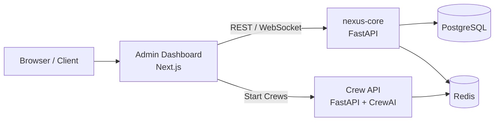

<div align="center">

# apki-core-platform (AIOS)

**AI Automation Monorepo — Admin Dashboard, Nexus Core, Crew API**

[](https://github.com/timo-goetz-ai/apki-core-platform/actions/workflows/ci.yml)
[](https://github.com/timo-goetz-ai/apki-core-platform/actions/workflows/deploy-prod.yml)
[](https://github.com/timo-goetz-ai/apki-core-platform/network/updates)
[](https://coolify.io)
[](.)

**Admin Dashboard:** [admin.automation-plus-ki.de](https://admin.automation-plus-ki.de) · **Auth:** Authentik SSO

</div>

---

## Was ist apki-core-platform?

Selbst gehostetes **Betriebssystem für KI-Automatisierung** (AIOS). Das Monorepo bündelt Steuerzentrale, Backend-Kern und Agenten-Orchestrierung — deployed auf Hetzner via Coolify.

## Architektur



## Stack

| Layer | Tech |
|-------|------|
| Frontend | Next.js 14, React, TypeScript, Tailwind |
| Backend | Python 3.11+, FastAPI, CrewAI, Alembic |
| Data | PostgreSQL 15, Redis 7 |
| Infra | Hetzner, Coolify, Docker, Terraform, Cloudflare |
| CI/CD | GitHub Actions, GHCR, Dependabot |
| Auth | Authentik SSO, 1Password secrets |

## Services

| Service | Pfad | Stack |
|---------|------|-------|
| Admin Dashboard | `services/admin-dashboard` | Next.js 14 |
| **nexus-core** | `services/nexus-core` | Python FastAPI |
| Crew API | `services/crew-api` | Python FastAPI + CrewAI |
| Landing Page | `services/landing-page` | Next.js (Marketing) |

## Quick Links

- [Onboarding Guide](docs/ONBOARDING.md)
- [Nexus Core Zugriff](docs/NEXUS_CORE_ZUGRIFF.md)
- [Operations Runbook](docs/OPERATIONS.md)
- [Cost Breakdown](docs/COSTS.md)
- [Architecture (Infra)](infrastructure/ARCHITECTURE.md)
- [ADRs](docs/adr/)

## Deployment

```
Push → main
  └→ GitHub Actions: Docker Build + Push → ghcr.io/timo-goetz-ai/nexus-*
       └→ Coolify: Auto-Deploy auf Hetzner CPX42
```

Docker images: `ghcr.io/timo-goetz-ai/nexus-core`, `nexus-admin-dashboard`, `nexus-crew-api`

---

## Infrastruktur

- **Server:** Hetzner CPX42 — SSH via 1Password / privaten Deploy-Key (IP nicht im Repo)
- **Orchestrierung:** Coolify (self-hosted)
- **Auth:** Authentik Forward Auth (SSO für alle Services)
- **Secrets:** 1Password Vault `03_INFRA_HETZNER_SERV`, Tag `homestack`

---

## Local Development

```bash
cp .mcp.json.example .mcp.json   # edit with your tokens (never commit)
npm install
npm run dev          # docker compose: nexus-core + dashboard + crew-api
npm run admin:dev    # dashboard hot reload
npm run test         # Jest smoke tests
npm run test:python  # pytest for FastAPI services
```

## Repo Structure

```
apki-core-platform/
├── services/
│   ├── admin-dashboard/   # Next.js UI
│   ├── nexus-core/        # FastAPI core engine
│   ├── crew-api/          # CrewAI orchestration
│   └── landing-page/      # Marketing site
├── docs/                  # ONBOARDING, OPERATIONS, COSTS, ADRs
├── infrastructure/        # Terraform, MCP servers, monitoring
├── .github/workflows/     # CI/CD
└── docker-compose.yml     # Local dev stack
```

---

Maintainer: [Timo Goetz](https://timo-goetz-ai.de) · [automation-plus-ki.de](https://automation-plus-ki.de)
